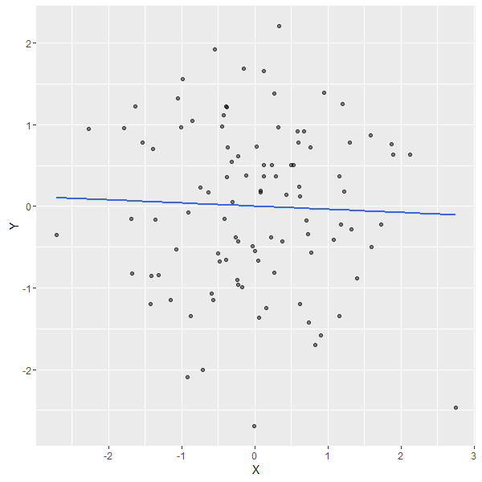
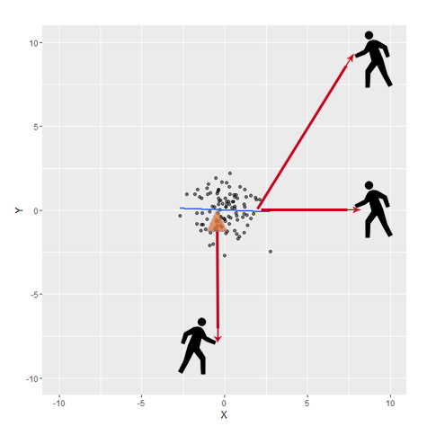

One of the common practices in regression models is performing diagnostics checks. They are usually carried out to check several aspects such as residuals, influential observations and outliers. Here we will focus on two concepts **(leverage and influence)**, but we will not get deep into the math behind them. We will try to visualize and catch the intuition behind them. We will also use a simple Shiny App to demonstrate the concept. And if you get the idea with a simple linear regression model, it will be easy to extend it to more complex ones. 


## Leverage and Influence


**Leverage** is a measure of how far an observation on the predictor variable *(X in our case)* from the mean of the predictor variable. To understand it, let's imagine a beam pivoted at a fixed hinge. The higher the leverage value of an observation, the more potential it has to impact the fitted model. This depends on how it conforms to the fitted model.


We can read this everywhere, but to get the concept easily, let's look at the following example. First, we will simulate 100 points and plot the regression line as follows:


```

set.seed(1523);

n <- 100;

X <- rnorm(n); X<-X-mean(X);
Y <- rnorm(n); Y<-Y-mean(Y)

```


 

Then we will zoom out and imagine a guy trying to pull the regression line, using a rope, towards him in different locations. Where will he have high potential for influence with the ablility to exert it? and where will he have high leverage but little effect on the fitted model?


<center>

</center>


If you think of the regression line as a rod pivoted at the mean *(here [0,0] since X,Y are centered)*, you will be able to conclude the answers easily. For example, the guy at [10,0] has high leverage since he stands far from the cloud of the X values. And although he has the potential of high influence, he will not be able to impact the regression line significantly because he exerts a force almost parallel to the line. On the other hand, the guy at [10,10] has both high leverage and high influence, since he stands far from the rest of the observations in X and Y. So he will affect the intercept and the slope of the regression line significantly. Following the same way of thinking about other points, you can conclude that the guy at [0,-10] will not have noticable effect on the fitted line. Since he pulls the line towards him at the pivot, the exerted force will no influence. What about any other guy who stands anywhere else? now it should be easy for you to expect whether he is influential or not.


## Shiny App


Here you can pick a point and it will be prepended to the 100 points generated earlier. Then you can see how the regression line is affected and how the influence measures change.


<iframe  src= "https://omaymas.shinyapps.io/Influence_Analysis/"  style="border: none; width: 900px; height: 800px" ></iframe>

